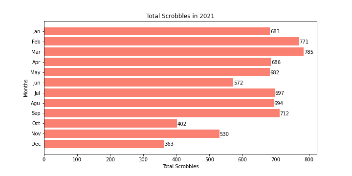

# lastfm-analyzer
My motivation has been to work on a project that can showcase my skills using Data Science technologies in Python. So I decided to create this repository, combining my love for writing code and listening to music.

Last.fm is a service that helps users keep track of their musical taste. I have been using it since 2019. Feel free to check my [profile](https://www.last.fm/user/Vini_Bueno) and see my scrobbles.

What I have **learned** during the development of this project:
- Requesting data from Last.fm servers using their [API](https://www.last.fm/api/intro);
- Working with timezones and UNIX timestamp;
- Using Data Analysis technologies such as Numpy, Pandas, and Matplotlib;
- Application of Python's Dataclasses and use of Composition between classes;
- Use of type annotations and Mypy for type checking.

The **main goal** was to replicate some of the statistics that the Last.fm website provide for their users. For instance:
- The total count of artists scrobbled in each month of a given year;
- The total count of albums scrobbled in each month of a given year;
- The total count of tracks scrobbled in each month of a given year;
- The total count of scrobbles in each month of a given year;
- The total count of scrobbles of the most listened artist in each month of that year.

## Usage

The main way of using this project is through the `PlotterFM`, which then calls the `AnalyzerFM` to analyze the user's data:

```
from PlotterFM import PlotterFM

plotter = PlotterFM('Vini_Bueno') # pass your username

plotter.most_listened_artists('2021')
plotter.total_scrobbles_year('2021')
plotter.total_tracks_year('2021')
plotter.total_albums_year('2021')
plotter.total_artists_year('2021')
```

Output example:

`plotter.total_scrobbles_year('2020')`


`plotter.total_scrobbles_year('2021')`



---

Another usage is calling the `AnalyzerFM` itself:

```
from AnalyzerFM import AnalyzerFM

analyzer = AnalyzerFM('Vini_Bueno') # pass your username

# show the highlights of a given period
print(analyzer.summary_highlights('year', '2021'))
print(analyzer.summary_highlights('month', '2021-8'))
print(analyzer.summary_highlights('week', '2021-9-17'))

# show the top 5 Artists, Albums or Tracks of a given period
analyzer.top_by('year', '2021', 'Artist').head()
analyzer.top_by('year', '2021', 'Album').head()
analyzer.top_by('year', '2021', 'Track').head()

analyzer.top_by('month', '2021-8', 'Artist').head()
analyzer.top_by('month', '2021-8', 'Album').head()
analyzer.top_by('month', '2021-8', 'Track').head()

analyzer.top_by('week', '2021-9-17', 'Artist').head()
analyzer.top_by('week', '2021-9-17', 'Album').head()
analyzer.top_by('week', '2021-9-17', 'Track').head()
```

Output examples:

`print(analyzer.summary_highlights('month', '2021-8'))`

```
--Month: 2021-8--
Total Artists listened: 162
Total Albums listened: 269
Total Tracks listened: 549
Total Scrobbles: 694
Average Daily: 23

--Previous month: 2021-07--
Total Artists listened: 111
Total Albums listened: 211
Total Tracks listened: 551
Total Scrobbles: 697
Average Daily: 23

--Statistics vs. previous month--
Total Artists listened: 46%
Total Albums listened: 27%
Total Tracks listened: 0%
Total Scrobbles: 0%
Average Daily: 0%

--Top listened--
Artist: Taylor Swift with 191 scrobbles
Album: Fearless (Taylor's Version) by Taylor Swift with 42 scrobbles
Track: Solar Power from Solar Power by Lorde with 7 scrobbles
```

`analyzer.top_by('week', '2021-9-24', 'Album').head()`

| | Artist | Album | Count |
| --- | --- | --- | --- |
| 0 | Tina Turner | Simply the Best | 20 |
| 1 | Adele | 21 | 14 |
| 2 | Linkin Park | Minutes to Midnight (Deluxe Edition) | 13 |
| 3 | Taylor Swift | Fearless (Taylor's Version) | 9 |
| 4 | Avril Lavigne | The Best Damn Thing (Expanded Edition) | 5 |

## Contributing
This project is **not** Open Source. You cannot modify or redistribute this code without explicit permission.

This repository is for practicing my skills only and does not represent a final product.

### Disclaimer
Some of the statistics that this software shows can be accessed through a free Last.fm account, but some of them are locked behind a subscription plan. With this repository, I have no intention whatsoever of demonetizing Last.fm.

As stated above, this is a mere student project to showcase my Python and programming skills.

If you would like to have far more interactive and richer graphs and stats, I recommend you to subscribe to their [Pro account](https://www.last.fm/pro).

**Do not** use this software as a way to circumvent their subscription plan.

## Credits
I used a variety of sources that guided me during the development, such as:
- Last.fm API Documentation: https://www.last.fm/api/intro
- Tutorial on how to make API Requests in Python: https://www.dataquest.io/blog/python-api-tutorial/
- Tutorial on how to use Last.fm API: https://www.dataquest.io/blog/last-fm-api-python/
- Data Analysis with Python from the University of Helsinki: https://csmastersuh.github.io/data_analysis_with_python_summer_2021/index.html

## Next Steps
This project is not over yet, but I believe I achieved my initial goal before I started writing a single line of code.

There are still a few [open issues](https://github.com/BuenoVini/lastfm-analyzer/issues) and a few new features ideas.

One thing I wish I added since the beginning was unit tests. I learned the hard way how important they are. Also, a logger would have been very useful as well.

The next step for me is to dive into the supervised learning subject. For instance, learning more about Linear Regression and Logistic Regression.
